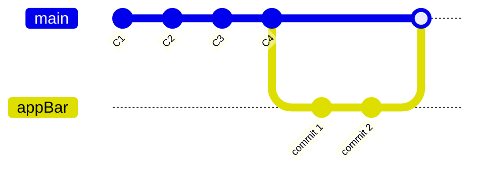
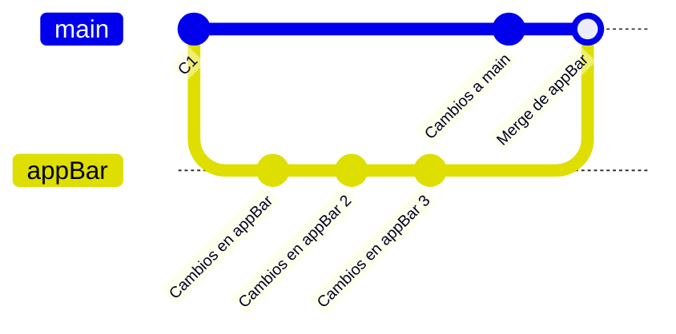
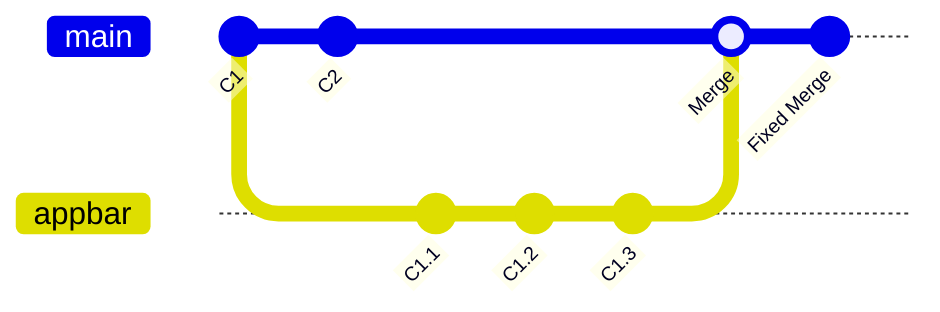
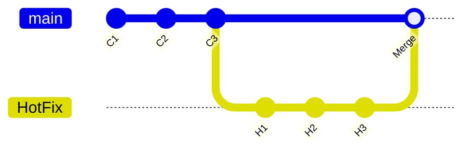
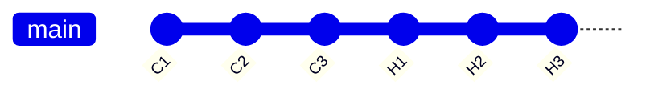
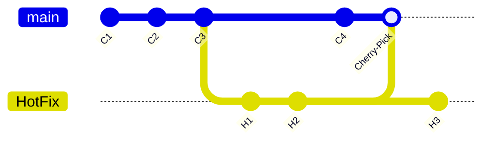

#GIT 

Git es un gestor de versiones de proyectos en texto plano. Funciona por ramas y guarda los __cambios__ hechos al proyecto en lugar de guardar todo el proyecto en cada versión.

![[git_branch.png]]

Funciona únicamente con texto plano, por ejemplo `.docx` esta en binarios y no puede ser leído directamente, ósea que necesita una decodificación especial. Por lo tanto, git no puede procesar estos cambios/archivos.

## Git Bash

Git bash es la terminal que usa git, esta utiliza MintTTY, el cual es un emulador de codigo abierto para Cywing, el cual es un emulador de terminal Unix para windows.

A continuacion, unos comandos que vale la pena recordar:

- Listar todo el contenido del directorio actual:

```bash
ls -l
```

- Conocer el directorio actual en el que se esta trabajando:

```bash
pwd
```

> [!bug]- `\..` y `\.`
> Cuando hacemos un `ls -l -a` aparecen estos dos directorios, estos son variables que referencian a:
> - `\..`: La ruta anterior.
> - `\.`: La ruta actual.
> Por ello el `cd ..` nos lleva a la ruta anterior.

- Acceder al historial de comandos:

```bash
history
```

Para repetir un comando listado, basta con poner `!`, seguido del numero de comando a repetir.

> [!question] Espacios en Windows MintTTY
> SI usas espacios en la terminal bash de git bash, recuerda que al usar espacios debes colocar el carácter de escape '`\`' para que no sea considerado como sentencia del código. 


## Comenzar en el Git Bash

Primero debemos configurar un correo y un nombre en el git para poder hacer commits, se usan las siguientes sentencias:

```bash
git config --global user.email 'genyaldair@gmail.com'
git config --global user.name 'g3n0s'
```

Si insertamos `git config -l (--list) (--show-origin`) nos va a enlistar nuestras configuraciones actuales.


### Para comenzar en Git usaremos las siguientes instrucciones:

1. Vamos a nuestro directorio de nuestro proyecto:

```shell
cd /mnt/c/Users/Genos\ O/AppData/Local/Programs/Obsidian/git/proyecto_test
pwd
```

2. Inicializamos git con `git init` (se hará la rama principal - de producción) entonces git comienza el trackeo del directorio:

```shell
git init
```

Podemos remover el repositorio con sus cambios haciendo un `rm -rf .git` y se borrará el repositorio en la carpeta.

3. Revisamos el status con `git status`.

```shell
git status
```

4. Avanzamos normalmente al comienzo de nuestro proyecto:

```shell
echo 'Agregando una nueva linea a test.txt' >> test.txt
ls
```

5. Hacemos `git add <file>` para cargar un archivo al stagging, esto empezara a trackear el archivo. Si checamos el status nos dice `Untracked files: new file: test.txt` y despues de hacerlo dice: `changes to be commited: new file: test.txt`

```shell
git status
git add test.txt
git status
```

6. Hacemos el commit con `git commit -m 'descripcion del cambio'`

```shell
git commit -m 'Se agrego test.txt'
```

7. Podemos comprobar el historial de cambios con `git log`.

```shell
git log
```

8. Ahora, cada vez que modifiquemos algun archivo que anteriormente este presente en el archivo o agreguemos algo a la carpeta, git nos hara un trackeo, podemos comprobarlo con `git status`:

```shell
echo 'Agregando una nueva linea a test.txt' >> test.txt
git status
```

9. Para respaldar los cambios (hacer una nueva version) agregamos al stagging nuestro contenido a guardar (en este caso toda la carpeta se cargara):

```shell
git add .
```

10. Ahora solo hacemos el commit para hacer una nueva version de la rama principal:

```shell
git commit -m 'se agrego mas texto a test.txt'
```

11. Ahora podemos ver el commit con `git log`:

```shell
git log
```

Entonces, secuencialmente creamos el archivo, inicializamos el repositorio, agregamos el archivo al futuro commit, hacemos commit. Después modificamos proyecto, agregamos archivos que se aplicaran al commit y hacemos commit.


> [!warning]- Mala practica
> Git no te permite hacer un commit sin comentar los cambios, por lo que si no agregas la descripcion, te enviara a un documento por defecto donde comentaras los cambios, este se abrira en vim. La ventaja de hacer el `git commit` y usar vim es que podemos comentar el commit con varias lineas.


Si agregamos un archivo al commit por error o no le queremos aplicar cambio, podemos retirarlo con `git remove <file>`. Esto necesita el argumento `-f` para forzar el borrado o `--cached` para guardar el archivo actual y restaurar el anterior (al del commit).

### Retroceder en la Rama

Si queremos retroceder al commit anterior podemos hacer uso de `git checkout <hash_del_commit>`, por ejemplo:

```bash
git checkout 7cf0699
```

Con esto retrocedemos en el tiempo, podemos modificar y hacer pruebas, cuando terminemos hacemos `git checkout master` y volveremos a la rama principal:

```shell
git checkout master
```

Para listar todas las ramas, podemos usar `git branch`:

```bash
git branch
```

Podemos visualizar el contenido que ha cambiado del ultimo commit a otro, haciendo uso de `git show`:

```bash
git show
```

Este es muy beneficioso ya que compara los commit's, por si algo del codigo escrito ya no puede ser compilado. Si estamos en la ultima linea del codigo, este incluso lo mencionara. Nos podra lo quitado y agregado. Se usa mucho para supervisar el trabajo

Cuando hacemos el `git show` este nos muestra las diferencias en la parte superior con `diff --git a/text.txt b/test.txt`, esto es un `git diff` y puede ser usado manualmente:

```shell
git diff 7cf0699 f076b0cf
```

El orden importa para esta sentencia, por lo que es importante que consideres poner primero el del pasado y el segundo el mas actual, asi podemos comparar el pasado con el presente.


> [!info] :LiFolderGit: Stagging
> Realmente lo que agregamos a git con `git add <file>` se esta cargando en un sector de la memoria ram (llamado stagging), cuando hacemos un commit se va finalmente la carpeta de `.git` dentro de nuestro repositorio. Entonces, lo que se esta trackeando es local, el add es cuando se prepara para enviarse a `.git` y hacer el commit.


>Master es conocido en github como main. En un futuro se estandarizara esto a main.

## Branch o Ramas en Git

En git manejamos ramas para hacer caminos alternativos de nuestros proyectos, tomamos una copia y trabajamos sobre ella, se ramifica partiendo de la prinicipal, la ventaja de esto es que podemos hacer un `merge` para unirlas cuando sea necesario, el flujo de trabajo se ve asi:

![[ramificacion_git.png]]

Master (main) es el normbre de la rama principal, head es el nombre de la ultima versión de la rama main, la rama `main`, esta cuenta con los commits v1, v2, v3 y v-act, etc. Para saber en que rama nos encontramos podemos hacer uso de `git branch`:

```bash
git branch
```

> [!example] Git reset
> Existe el comando `git reset`, el cual nos puede regresar a una versión anterior del código, eliminando las versiones mas recientes de los commit's a partir de esta. Se puede usar con la sentencia `--hard`, esta es la mas peligrosa de todas, ya que eliminara todo contenido presente en el proyecto y regresara a exactamente como se encontraba la carpeta de nuestro proyecto (se usa cuando de plano se arruino el proyecto). También se puede usar con las sentencia `--soft`, el cual guardara todo lo que tengamos dentro del `stagging`, es decir, todo lo que le escribimos `git add <file>`.

Hay una forma de evitar hacer el `git add <files>` y posteriormente el `git commit -m 'comentario'` y hacer esto de una vez, osea, que se agregara todo al stagging y se hará el commit, se usa `git commit -a`:

```bash
git commit -am 'Unos comentarios'
```

Agregamos la `m` para agregar un comentario sin abrir vim.

> [!Warning] Solo con Archivos Trackeados
> Esto de `-a` solo funciona para agregar al `stagging` a los archivos modificados, sin embargo, si hay un archivo nuevo este no esta siendo trackeado, por lo que si es necesario agregarlo manualmente con `git add <file>`.


### Crear una Nueva Rama

Cuando desarrollamos por ejemplo un repositorio appBar, trabajamos en local con dos commits, posteriormente lo enviamos a produccion, a este proceso de crear una nueva version partiendo de los commits que hicimos es lo que se conoce como `merge`.


Vamos a crear un commit para exclusivamente modificar una parte del proyecto, ejemplo el appBar:

```shell
echo 'Creacion del appbar' > appbar.txt
git add appbar.txt
git commit -m 'Se agrego el appBar'
```

Ahora, para finalmente crear una rama hacemos uso de `git branch appBar`:

```shell
git branch appBar
```

Comprobamos si se creo (con `git branch` podemos saber la rama en la que estamos):

```shell
git branch
```

Con `git checkout` también nos podemos mover de rama a rama:

```shell
git checkout appBar
git branch
```

Modificamos el archivo y hacemos `git status`:

```shell
echo 'Cambios cometidos al appbar' > appbar.txt
git status
```

Ahora, para hacer un commit con la modificacion en la segunda branch:

```shell
git commit -am 'Se hizo una rama secundaria con cambios a appbar'
```

Mostramos los cambios con `git show`:

```shell
git show
```

Ahora con `git log` podemos apreciar que tenemos un commit en una branch secundaria llamada appbar:

```shell
git log
```

### Descripcion de Commit Detallada

Con `git log --stat` podremos visualizar mas a detalle los cambios de cada commit, nos muestra inclusive los `bytes` modificados de cada uno (revisar en el bash de git):

```shell
git log --stat
```


## Hacer un Merge

El merge consiste en traer los cambios ejecutados en una rama secundaria hacia otra rama, por ende, este se hace hacia la rama en la que estemos posicionados. Para ello no debemos tener cambios sin guardar para hacerlo de manera satisfactoria. La unión de ambas ramas será reconocido como un commit en la rama a la que se trajeronn los cambios.

```bash
git checkout master
git merge -m 'Unimos appBar a main' appBar
```

Entonces, si tenemos la rama `master` y queremos hacer que los cambios de la rama `appBar` se unan a esta, debemos tener el head en `master` y hacer un merge de la rama `appBar`. Esto nos creara un commit en `master`.



### Conflictos en un Merge

Cuando hay dos cambios a un trabajo colaborativo, por ejemplo que dos personas cambien lo mismo en `main` y en `appBar`, esto nos va a generar un conflicto,  estos deben ser corregidos a mano, cuando esto se solucione, se ejecutara exitosamente el merge.

Cuando salten conflictos, el head se pondra en un modo llamado `MERGING`, el cual nos podra los conflictos de nuestros archivos con el siguiente formato:

```
<<<<< HEAD
	sentencia_con_conflictos('texto')
===== 
	sentencia_con_conflictos('texto diferente')
>>>>> appBar
```

En VSCode nos hará asistencia para elegir uno de los dos cambios paso a paso, para optimizar el proceso.

Para solucionar el conflicto, debemos borrar las lineas que no deseamos:

```
	sentencia_con_conflictos('texto')
```

Una vez hecho esto, hacemos un commit (`commit -am 'Solucionarmos el conflicto con el merge`) y ahora tendremos lo siguiente:



Entonces, ahora tenemos una versión con los conflictos por si cometimos algún error al arreglar estos, podamos volver a ese punto.

## Git Graph

Podemos visualizar graficamente nuestro repositorio con sus respectivos cambios, mediante un `git log`, con los parametros extra:

```bash
git log --graph
```

Ademas, podemos agregarle a la sentencia unos detalles extra, tambien podemos volver esto un alias:

```bash
alias ggo='git log --graph --decorate --oneline'
```


> [!important] Visualizar TODAS las RAMAS Creadas
> Podemos visualizar todas las ramas creadas y como interactuaron, basta con el comando:
> ```bash
> git show-branch
>```


## Git Rebase

`git rebase` consiste en unir los commit's de una rama secundaria a el historial completo de main, logrando que el desarrollo de nuestro proyecto sea meramente lineal y por versiones, esto es útil principalmente en desarrollo local, pero en GitHub es una mala practica.

>Visualmente se vería asi:

- Desarollo con `merges`:


- Desarrollo con `rebase`:


Para hacer exitosamente un rebase se deben seguir los siguientes pasos:
- Creamos nuestra rama secndaria, por ejemplo, `experimental`:
	```bash
	git branch experimental
	git checkout experimental
	```
- Hacemos los commits que debemos hacer:
	```bash
	git commit -am 'Cambios experimentales'
	```
- Despues hacemos un rebase __de la principal hacia la rama secundaria__:
	```shell
	git rebase main experimental
	```
- Finalmente, hacemos el rebase de la rama secundaria a la principal:

	```shell
	git rebase experimental main
	```

- Opcionalmente, podemos eliminar la rama secundaria, ya que ahora no nos es util:
	```shell
	git branch -D experimental
	```


> [!Warning]- Solo usar en proyectos locales, en la nube no se usa nunca rebase.
> Debido a que resulta confuso el que commit se hizo primero y cual despues, no se usa, no es muy eficiente para entender por completo el desarrollo del proyecto.

## Git Stash

El `stash` de git es una herramienta muy poderosa y útil, es el complemento necesario para poder moverse libremente entre versiones mientras haces tu desarrollo.

Imagina la situación en la que avanzas a tu versión actual de aplicación pero quieres regresar a un commit anterior, una rama alterna solo para hechar un vistazo para implementar algo que quieres hacer ahora... ¿Como lo haces sin descartar los cambios que llevas actualmente? Bueno, para eso existe `git stash`.

Para usar git stash, basta con aplicar cambios desde el ultimo commit, cuando tengamos cambios que queremos almacenar, directamente introducimos:

```shell
git stash
```

Esto almacenara en este espacio `stash` ubicado de la memoria ram, nuestros avances. Podemos tener mas de un elemento guardado en el `stash`, para listarlos introducimos:
```shell
git stash list
```

Esto nos enumerara las cosas que pongamos en el `stash`, la ventaja de esto es que podemos manejarlos con el numero asignado a cada uno por si queremos, por ejemplo, eliminarlo con `git drop <numero>`.

Cuando hayamos hecho lo que debiamos y regresemos a continuar con el proyecto, solamente debemos introducir:

```shell
git stash pop
```

Esto devolverá los cambios que teniamos a la rama, desde el commit en el que estábamos. Si hacemos `git show` podremos ver que efectivamente se ha insertado texto.

Ahora, para descartar los cambios de un `stash`, debemos introducir los comandos:

```shell
git stash drop [<stash>]
```

Opcionalmente todos estos comandos aceptan el parámetro del `stash` al que nos referimos.

### Poner Cambios en una Rama

Una de las funciones mas utiles del `git stash` es colocar los cambios que tenemos en esta seccion a una nueva rama, la ventaja de esto es que podemos hacerlo en el momento que queramos una vez desplazado a un commit. Por ejemplo __si no queremos que los cambios actuales se vayan a un commit en main, si no a otra rama__.

Primero, avanzamos a nuestro proyecto desde cualquier commit, posteriormente lo colocamos en el `stash`:

```shell
git stash
```

Ahora, el contenido en el `stash` lo podemos poner en una rama secundaria con:

```shell
git stash branch <nombre_de_la_rama>
```

Ahora, podemos hacer un push con `-u` para poder simplemente decir `git pull` o `git push`. Esta es la forma de manejar nuestros cambios temporales, como cambios pequeños que no necesitan un commit aun.

## Git Clean

`git clean` es un comando que va a eliminar todos los archivos que se crean dentro del proyecto del repositorio, estos pueden ser archivos temporales generados por el compilador. Estos archivos te dirán que debes hacer un `git add` para empezar a trackearlos, sin embargo, con el `git clean` podemos eliminarlos todos de golpe.

Debemos introducir después de la sentencia, el nivel de poder del borrado, siendo `-f` como el que forzara el borrado de todos los archivos. Consultar `git clean -h` para mar informacion.


> [!Warning] `.gitignore`
> Todo lo contenido en `.gitignore` será ignorado incluso para mostrarse en el `git status`, por lo que `git clean` no tendrá ningún efecto en este, inclusive si traes muchos `.png` que están presentes, se quedaran ahí aunque hagas un `git clean -f`.

## gitk

`gitk` es una interface grafica que funciona con git, solamente debemos pocicionarnos en la rama que deseamos ver con la GUI. Para lanzar gitk solo basta con lanzar el comando:

```bash
git checkout main
gitk
```


Aquí te dejo el apunte de `git revert` en el formato que prefieres:

---

## Git Revert

El comando `git revert` en Git se utiliza para deshacer cambios sin eliminar el historial. A diferencia de `git reset`, que elimina commits, `git revert` crea un nuevo commit que revierte los cambios de un commit específico, manteniendo el historial del proyecto.

### ¿Qué hace `git revert`?
- Reversión segura: No borra el commit que estás revirtiendo; en su lugar, crea un nuevo commit que introduce los cambios opuestos.
- Mantenimiento del historial: Es importante en proyectos colaborativos donde el historial debe conservarse intacto.

### Sintaxis básica

```bash
git revert <commit>
```

Donde `<commit>` es el hash del commit que quieres revertir. Puedes obtener este hash con el comando `git log`.

### Pasos para usar `git revert`

- Ver el historial de commits:

  ```bash
  git log
  ```

  Este comando te mostrará los commits recientes junto con su hash. Identifica el commit que quieres revertir.

- Ejecutar `git revert`:

  ```bash
  git revert <commit>
  ```

  Esto crea un nuevo commit que deshace los cambios del commit especificado.

### Revertir múltiples commits

Si deseas revertir más de un commit, puedes usar la opción `--no-commit`:

```bash
git revert --no-commit <commit1> <commit2>
git commit
```

Esto aplicará todos los reverts sin hacer commits intermedios, permitiéndote crear un único commit al final.

### Deshacer un `git revert`

Si te equivocas y quieres deshacer un revert, simplemente haz un revert del revert anterior:

```bash
git revert <hash-del-commit-revert>
```

Esto reintroduce los cambios revertidos.

## Git Cherry Pick

`git cherry-pick` es un comando en Git que permite aplicar cambios de commits específicos de una rama a otra, sin necesidad de fusionar ramas enteras. Es útil cuando solo necesitas un conjunto particular de cambios, en lugar de mezclar todo el historial de una rama. 

Esto por ejemplo, si queremos fusionar unos cambios de `HotFix` a `main` pero no toda la rama porque algunos bugs traen mas bugs... Entonces, hacemos un `cherry-pick`:


Entonces, imaginemos que estamos como en el ejemplo, en main, en `C3` y queremos traer todos los cambios de `HotFix` hasta `H2` sin hacer un merge de toda la rama, para ello debemos ejecutar la sentencia:

```shell
git checkout main
git cherry-pick <HASH_H2>
```

Esto va a hacer que el commit se coloque en `main` como un solo cambio, por lo que es recomendable usarla en repositorios locales ya que altera el flujo de trabajo. Esto se puede hacer entre ramas, pero no con la rama principal en GitHub. 

Si ahora decidimos hacer un `merge` tendremos el inconveniente de tener el conflicto de traer los mismos cambios dos veces, por lo que se tendrán que solucionar a mano mas adelante.
### Cherry-pick múltiple

Si necesitas aplicar varios commit al mismo tiempo, puedes hacerlo especificando un rango o múltiples hashes:

- **Rango de commit's:**
  ```bash
  git cherry-pick <start-commit-hash>^..<end-commit-hash>
  ```
  Esto aplicará todos los commit's desde `<start-commit-hash>` hasta `<end-commit-hash>`.

- **Múltiples commit's individuales:**
  ```bash
  git cherry-pick <commit1-hash> <commit2-hash> <commit3-hash>
  ```

#### Resolviendo conflictos durante un `cherry-pick`

Si existen conflictos al aplicar los cambios:

1. Git pausará el proceso y te notificará.
2. Resuelve los conflictos en los archivos afectados.
3. Después de resolver los conflictos, añade los cambios resueltos:
   ```bash
   git add <archivo-afectado>
   ```
4. Finaliza el proceso con:
   ```bash
   git cherry-pick --continue
   ```

- Si decides que no quieres continuar con el `cherry-pick`, puedes abortarlo:
	```bash
	git cherry-pick --abort
	```
#### Opciones adicionales

- **`-n` o `--no-commit`:** Aplica los cambios pero no crea un commit automáticamente, dejándote hacer modificaciones antes de confirmar los cambios.
  
- **`--edit` o `-e`:** Te permite modificar el mensaje del commit después de aplicar el `cherry-pick`.

- **`--quit`:** Si quieres salir del proceso de `cherry-pick` sin modificar los archivos actuales, pero sin abortar completamente (es útil cuando hay un conflicto y decides hacer otras cosas antes de continuar).

## Git Amend

`--amend` es un parámetro opcional que colocamos al hacer un `commit`, este parámetro hará que este commit sea remplazado por el ultimo, la traducción de `amend` es `enmendar`, entonces estamos "enmendando" los errores del último commit.

Es importante destacar que esto solamente se usa con un commit local, no es recomendable hacerlo con algun commit que ya se subió a nuestro repositorio en la nube.

## Git Reset y Git Reflog

`git reflog` nos mostrara un historial de todas las acciones que hemos realizado con git, desde un commit hasta la creación de una rama, inclusive un `reset` que se menciona mas adelante. 

Basta solamente con usar:
```shell
git reflog
```

`git reset` es un comando de ultimo recurso, se usa cuando el proyecto esta practicamente roto y no hay una forma de solucinarlo. Al igual que [[GIT#Git Clean|Git Clean]] tiene como sentencia la intensidad, esta se consulta con `git reset -h` aunque normalmente se usa `git reset --hard` o `--soft`. Hard hara un descarte total de nuestro avances y soft los guardara en el stash.

Para usar `git reset`:

```shell
git reset --hard <hash_commit/reflog>
```

Ahora, podemos restaurar el proyecto en su totalidad por si cometes algún error.

## Git Grep y Git Log

Podemos hacer uso de `git grep` para buscar palabras en nuestro repositorio, inclusive enumerar cuantas veces se ha ocupado una serie de caracteres. La sentencia del comando es la siguiente: `git grep <palabra_a_buscar>`:

```shell
git grep 'Git'
```

Podemos conocer la linea en la que se uso en cada archivo con el parámetro `-n`:

```shell
git grep -n 'Hola'
```

Y para concer el numero de veces que se encuentra la palabra usamos `-c`:

```shell
git grep -c 'a'
```


`git log` no solamente sirve para mostrar los commit's que hemos hecho, si no también nos sirve para buscar contenido dentro de nuestros mensajes/comentarios de estos. Para buscar palabras clave dentro de nuestros commit's hacemos uso de:

```shell
git log -S 'merge'
```

Esto es útil para seccionar los commit's donde, por ejemplo, se hizo un merge.

## Git Blame

Git blame tiene la única función de revisar que persona hizo cambios especificaos a un archivos, la ventaja es que nos muestra la fecha, la linea y muchos datos interesantes, de esta forma podemos designar `culpas` o `blame` como lo dice el nombre del comando:

```shell
git blame -c README.md
```

## --help

Si tenemos dudas con un comando en especificio, agregamos la sentencia `--help` y esto nos arrojara la documentacion oficial de ese comando, la ventaja es que esta documentacion esta guardada en local:

```shell
git blame --help
```

Por defecto se abre en `man`, si quisieramos que se abra en el navegador, debemos bajar git-doc:

```shell
sudo apt install git-doc
```

Posteriormente configurar el navegador por defecto:

```shell
git config --global help.browser microsoft-edge
git config --global help.format web
```

Con eso se abrirá en el navegador cada que necesitemos ayuda con un comando especifico.

>Si solo queremos consultar ayuda brevemente, usamos `man git blame` por ejemplo.

## Git Insights

Es una seccion en nuestro repositorio que nos muestra todas las estadísticas del proyecto, desde el trafico completo hasta el grafico de red como en `gitk` pero con la ventaja que lo divide por usuario. Inclusive podemos consultar los `forks` a nuestro código.

## Comandos Adicionales

- `git shortlog [-sn] [--all] [--no-merges]` - Muestra los commit's que ha hecho cada usuario (mostrar solo cantidad) (contar los borrados) (no mostrar merges)
- `git config --global alias.<nombre> '<sentencia_alias>'` - Es para crear alias dentro de git, por ejemplo, para el de arriba: `git config --global alias.stats 'shortlog -sn -all --no-merges`.
- `git branch -r` - Muestra las ramas que tenemos en el repositorio remoto, con `-a` podemos enlistar las locales y las remotas.

