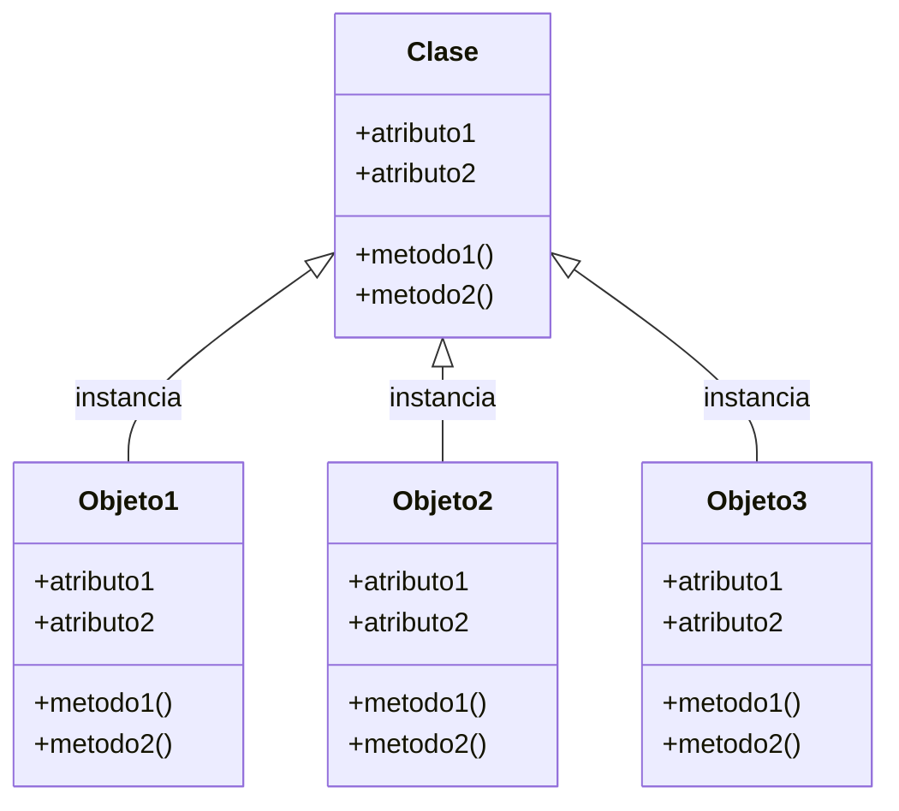

#Python 

Una clase es el esqueleto, una plantilla, el generador de objetos, para poder crear un objeto, debemos pedirle a una clase que lo haga. Una clase puede contener métodos y atributos, cuando creamos un objeto a partir de una clase le llamamos instancia. 

**Los atributos en una clase son las variables** que contiene dentro de si y los metodos son las funciones con las que cuenta. 

> Cabe aclarar que todas las clases vienen de una clase llamada `Clase Padre`.



## Crear una clase

```python
class Persona:
	# Para que sea una clase valida, pero no hacer el contenido
	pass

print(type(Persona))
```

Para crear una clase funcional en python, necesitamos utilizar un metodo, `init` en este caso, el cual es un metodo inicializador. Este metodo es como un constructor (el que crea los objetos), sin embargo en python el constructor no esta explicito en el lenguaje y se manda a llamar por el mismo lenguaje. Entra en funcionamiento cuando creemos el objeto, inicializa los atributos que le otorguemos a nuesto objeto.

```python
class Persona:
	def __init__(self):   # Self = uno mismo, refiere al objeto a crear
	# Doble guion bajo: double underscore = dunder (dunder init)
		self.nombre = 'Juan'
		self.apellido = 'Perez'
		self.edad = 25

persona1 = Persona() # persona1 ahora es un objeto que se crea con la clase Persona
print(persona1.nombre)
print(persona1.apellido)
print(persona1.edad)
```

## Argumentar Objetos

```python
class Persona:
	def __init__(self, nombre, apellido, edad):
		self.nombre = nombre
		self.apellido = apellido
		self.edad = edad

persona1 = Persona('Juan', 'Perez', 25)
print(f'Objeto 1: {persona1.nombre}, {persona1.apellido}, {persona1.edad}')

persona2 = Persona('Pedro', 'Ramirez', 56)
print(f'Objeto 2: {persona2.nombre}, {persona2.apellido}, {persona2.edad}')
```

## Modificar Atributos de un Objeto

Para el codigo anterior, modificar el objeto uno seria tal que:
```python
persona1.nombre = 'Carlos'
persona1.apellido = 'Soto'
persona1.edad = '22'

print(f'Objeto 1: {persona1.nombre}, {persona1.apellido}, {persona1.edad}')
```

## Métodos en Clases

Un método es una función que se encuentra en la clase, que se le asignará a todas las instancias que creemos.

```python
class Persona:
	def __init__(self, nombre, apellido, edad):
		self.nombre = nombre
		self.apellido = apellido
		self.edad = edad
		
	def mostrarDetalle(self):   # Debemos agregar self en el metodo de instancia, para que sea una funcion vailda de esta.
		print(f'Persona: {self.nombre} {self.apellido}, {self.edad}')
		# Debemos agregar self.xxxxx cuando estemos hablando de variables que estan dentro de nuestra instancia

persona1 = Persona('Juan', 'Perez', 22)
persona1.mostrarDetalle()

persona2 = Persona('Daniel', 'Ventura', 27)
persona2.mostrarDetalle()   # Reutilizamos el metodo mostrarDetalle
```


> [!example]- `self`
> No es necesario que self se llame asi, podemos asignarle cualquier otro nombre, por ejemplo en otros lenguajes se utiliza normalmente `this`, es completamente valido usar otro nombre, de hecho es probable que lo encuentres en códigos prácticos de personas que usan diversos lenguajes.

## Usar Funciones de Clases

Podemos utilizar una función contenida en una clase sin necesidad de crear un objeto exclusivo para esta, de esta manera podemo evitar redundancias:

>Sin embargo, debemos entregarle un objeto a la clase, para que usar self sea valido.

```python
persona3 = Persona('Daniel', 'Tommy', 27)

Persona.mostrarDetalle(persona3)
```

## Agregar mas Atributos a Nuestro Objeto

Podemos asignarle mas atributos a nuestro objeto, sin necesidad de modificar la clase o las demas instancias.

```python
persona1.telefono = '5566482731'
# En este momento el atributo telefono se le asigno a el objeto persona 1 perseo los demas objetos no lo tienen
```

>Los objetos no son mas que referencias a clases con valores especificos, por lo que los objetos solo son apuntadores a direcciones de memoria de la clase con ciertos atributos.


> [!success]  N Parámetros a las Clases
> Como en  las [[Funciones#Argumentos variables]] , podemos asignarle n valores y posteriormente usar el [[Desempaquetamiento]] para poder trabajar con tuplas o diccionarios.

## Saber Atributos de Clase y de Objeto

Podemos conocer cuales son los atributos de clase y de objeto con el metodo dunder `__dict__` para los objetos y ``:

```python
class Persona:
	contador_personas = 0
	
	def __init__(self, nombre, apellido):
		self.nombre = nombre
		self.apellido = apellido

persona1 = Persona('Juan', 'Perez')
print(persona1.__dict__)
```

¿Y si le agregamos atributos de vuelo al objeto? Tambien se agregan a `__dict__`:

```python
persona1.edad = 27
print(persona1.__dict__)
```

## Sobrecarga de Constuctores

En python tenemos el metodo `__init__` para inicializar un objeto, sin embargo, podemos simular una sobrecarga para inicializar los objetos, es decir, que se creen de una manera diferente, para ello hacemo uso de `@classmethod` y el return debe ser `cls(params)` como funcion, lo cual va a llamar al metodo `__init__` con los parametros que seleccionemos, de esta manera simulamos otra forma de inicializar un objeto.

Aqui se puede apreciar la forma de sobrecargar un constructor de Objetos:

```python
class Persona:
	def __init__(self, nombre, apellido):
		self.nombre = nombre
		self.apellido = apellido
	
	@classmethod
	def vacia(cls):
		return cls(None, None)
	
	@classmethod
	def juan(cls, apellido):
		return cls('Juan', apellido)
	
	def __str__(self):
		return f'Persona: [Apellido: {self.apellido}, Nombre: {self.nombre}]'
	

persona1 = Persona('Pedro', 'Paramo')
print(persona1)

juan1 = Persona.juan('Perez')
print(juan1)

p_vacia = Persona.vacia()
print(p_vacia)
```

## Representar Objetos en Python

Representar un objeto en python quiere decir generar un string con el estado del objeto, es decir, mandar a llamar los valores de cada atributo de cada objeto. Existen tres formas de representar un objeto en python y todos son dunder:

- `__repr__`, Es mas enfocado al los programadores y no al usuario final, igualmente se manda a llamar con `print()` sin o se ha sobrescrito `__repr__`, pero tambien en un `f-string` se puede haciendo uso de `objrepr!r`:

```python
class Persona:
	def __init__(self, nombre, apellido):
		self.nombre = nombre
		self.apellido = apellido
	
	def __repr__(self):
		# Con self.__clas__.__name__ accedemos al nombre de la clase
		# Util si se ocupa la herencia
		return f'{self.__class__.__name__}(nombre={self.nombre}, apellido={self.apellido})'

persona1 = Persona('Juan', 'Perez')
print(persona1)

print(f'Objeto persona1: {persona1!r}')
```

- `__str__`, si se sobrescribe, se manda a llamar este, pero en caso que no, se manda a llamar al metodo `__repr__`. `__str__` esta enfocado al usuario final:

```python
class Persona:
	def __init__(self, nombre, apellido):
		self.nombre = nombre
		self.apellido = apellido
	
	def __repr__(self):
		return f'{self.__class__.__name__}(nombre={self.nombre}, apellido={self.apellido})'
	
	def __str__(self):
		return f'{self.__class__.__name__}: {self.nombre} {self.apellido}'

persona1 = Persona('Juan', 'Perez')
print(persona1)
```

- `__format__`, por default, manda a llamar al metodo `__str__`, se manda a llamar con una `f-string` (requiere parametros: `self, format_spec`):

```python
class Persona:
	def __init__(self, nombre, apellido):
		self.nombre = nombre
		self.apellido = apellido
	
	def __repr__(self):
		return f'{self.__class__.__name__}(nombre={self.nombre}, apellido={self.apellido})'
	
	def __str__(self):
		return f'{self.__class__.__name__}: {self.nombre} {self.apellido}'
	
	def __format__(self, format_spec):
		return f'{self.__class__.__name__} con nombre {self.nombre} y apellido {self.apellido}'

persona1 = Persona('Juan', 'Perez')
print(f'{persona1}')
```


> [!success] Conocer todos los metodos disponibles de una clase:
> Con el uso de `dir(objeto)` podemos conocer todos los metodos disponibles de una clase u objeto:
> ```python
>print(dir(object))
>```

## Atributos Publicos, Protegidos y Privados

En python, este concepto es manejado de una forma especial, no es similar a otros lenguajes de programación.

- Al declara una clase, en el metodo `__init__`, si a `self.variable` lo dejamos como tal, la variable es considerada un atributo publico.

- En cambio, si agregamos `self._protegido`, el guion medio detona que es un atributo al que aunque se pueda, no se debe acceder _directamente_ desde fuera de la clase, por lo cual esta protegido (Si con un getter o setter). 

- Finalmente, si a un atributo le agregamos `self.__privado` estamos detonando que ese atributo es especificamente para usarse dentro de esa clase, no se debe acceder ni por herencia.

Todo esto aplica también para métodos de clase y son meramente convenciones.

```python
class MiClase:
	def __init__(self, publico, protegido, privado):
		self.publico = publico
		self._protegido = protegido
		self.__privado = privado
```

Si intentamos acceder directamente:

```python
clase = MiClase('Valor publico', 'Valor protegido', 'Valor privado')

try:
	print(clase.publico)
	# No es buena practica, de hecho el IDE no lo suguiere:
	print(clase._protegido)
	print(clase.__privado)
except Exception as e:
	print('No se pudo acceder al dato:', e)
```

Como podemos apreciar, al atributo privado no se puede acceder, python lo proteje de cierta manera, sin embargo se ubica en la ruta `objeto._clase__privado`: ^rutaProtegido

```python
clase = MiClase('Valor publico', 'Valor protegido', 'Valor privado')

# Tampoco es buena practica
print(clase._MiClase__privado)
```

## Orden de Inicialización de Objetos

Los objetos inicializan con el metodo de clase `__init__`, sin embargo, en la herencia pasa algo curioso, si un objeto Hijo no se inicializa, automaitcamente toma el metodo `__init__` de la clase donde herda:

```python
class Padre:
	def __init__(self):
		print('Objeto Padre, inicializado')

class Hija(Padre):
	pass

hija = Hija()
```

Si la clase hija define su propio metodo, simplemente se sobrescribe y lo toma de la clase hija. Con `super().__init__` podríamos acceder a la clase `__init__` de la clase padre. Pasa exactamente con los métodos de clase (`super().metodo_clase_padre()`).

## Revisar Atributos de Clase

Con el metodo dunder `__vars__` podemos consultar los metodos y variables presentes en una clase, nos regresara estos mismos como un diccionario.

```python
class MiClase:
	CONS = 'NADA'

print(vars(MiClase))
```