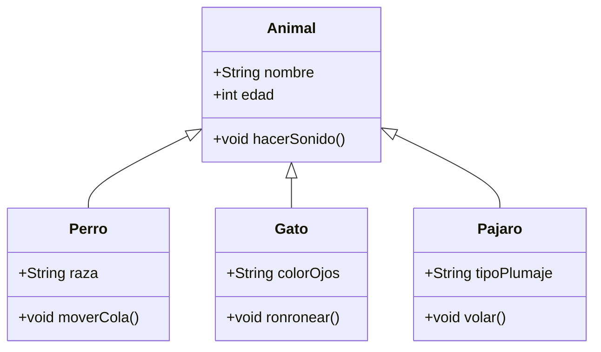

#Python #Herencia

El concepto de herencia nace de ejemplos de la vida real, todas las clases provienen de una clase padre que, define el comportamiento basico de esta. Por ende, cuando usamos una clase en python, esta tiene herencia de la clase padre, ofreciéndole método como `__init__` o `__del__`. 



Como se puede ver, **animal es la clase padre**, de ahí parten las demás clases, las cuales pueden tener otros métodos o atributos pero **todos cuentan con nombre, edad y hacen un sonido**, por lo que no hay que asignarle este tipo de características a los demás.


> [!abstract] `Object`
> Para todas las clases en python, a menos que especifiquemos lo contario, todas las clases que creemos heredaran de manera indirecta las caracteristicas de la clase padre llamada `Object`.


A continuacion, un código el cual, la clase padre es `Persona (nombre, apellido y edad)` y su clase heredada con `Empleado (sueldo)`:

```python
# Aqui definimos nuestra clase llamada Persona
class Persona:
	def __init__(self, nombre, apellido, edad):
		self._nombre = nombre
		self._apellido = apellido
		self._edad = edad

class Empleado(Persona):
	def __init__(self, nombre, apellido, edad, sueldo):
		super().__init__(nombre, apellido, edad)
		self._sueldo = sueldo

empleado1 = Empleado('Juan', 'Perez', 22, 9000)
# Esto es una mala practica (x._var)
print(empleado1._nombre)
print(empleado1._apellido)
print(empleado1._edad)
print(empleado1._sueldo)
```

>A la clase padre, Persona, podríamos incluirle `(object)` como lo hacemos en la clase `Empleado(Persona)`, sin embargo, al no aclararlo, por defecto esta heredando todas las características de esta misma.

Para poder hacer uso de la herencia de parametros de nuestra clase, tenemos que hacer uso del **constructor de la clase padre**, el cual es **`super()`**, el cual nos permite acceder a los métodos de la clase padre, posteriormente usamos `__init__` para inicializar la clase padre junto con los parámetros para que los use con esta misma.

## Reutilizacion de Metodos de Clases Padre

Para el caso en que por ejemplo, para el método `__str__` que deseamos imprimir variables que ya habíamos designado a imprimir pero queremos sobrescribirlo para que lo haga también con los nuevos parámetros de nuestra clase heredada, podemos mandar a llamar al método anterior y sobrescribirlo, ósea reusarlo pero a su vez, remplazarlo.

Para hacer uso de otro metodo de una clase padre basta con usar `super().__metodoUsado__()`.

```python
class Persona:
	def __init__(self, nombre, apellido, edad):
		self._nombre = nombre
		self._apellido = apellido
		self._edad = edad

	def __str__(self):
		return f'Nombre: {self._nombre}, Apellido: {self._apellido}, Edad: {self._edad}'

class Empleado(Persona):
	def __init__(self, nombre, apellido, edad, sueldo):
		super().__init__(nombre, apellido, edad)
		self._sueldo = sueldo

	def __str__(self):
		return f'{super().__str__()}, Sueldo: {self._sueldo}'

persona1 = Persona('Juan', 'Castro', 22)
empleado1 = Empleado('Fernando', 'Martinez', 22, 18000)

print(persona1)
print(empleado1)
```

## Herencia Múltiple

Una clase puede heredar atributos y métodos de mas de una clase, ósea tener mas de una clase padre, por ejemplo, la clase `Cuadrado` puede heredar `alto y ancho` de `FiguraGeometrica` y también color de una clase llamada `Color`. 

```python
class FiguraGeometrica:
	def __init__(self, alto, ancho):
		self._alto = alto
		self._ancho = ancho
		
class Color:
	def __init__(self, color):
		self._color = color

# Clase con Herencia Multiple (el orden es importante)
# Se importa solo un lado porque es un cuadrado (L x L)
class Cuadrado(FiguraGeometrica, Color):
	def __init__(self, lado, color):
	# Ya no podemos usar super... porque.. de que clase estamos hablando?
		FiguraGeometrica.__init__(self, lado, lado)
		Color.__init__(self, color)
		
	def calcularArea(self):
		return self._alto * self._ancho

cuadrado1 = Cuadrado(25, 'Rojo')
print(f'Area del cuadrado {cuadrado1.calcularArea()}, Color: {cuadrado1._color}')
```

Como ya no hacemos uso de `super().xxxxx`, ahora debemos mandar a llamar a la clase, aclarar que hablamos de la misma instancia con self, para que pueda entender que hablamos de una clase padre (`FiguraGeometrica.__init__(self)`). La clase padre es declarada desde que introducimos su nombre en los paréntesis (`class Cuadrado(FiguraGeometrica, Color)`).
## Método MRO - Method Resolution Order

Es un método que nos permite conocer la jerarquía en la que se van a resolver nuestras ordenes.

Para el ejemplo de arriba, podemos saber el orden en el que se van a ejecutar los métodos de la clase cuadrado mediante el siguiente comando:

```python
print(Cuadrado.mro())
```

La respuesta es el orden en el que se mandan a llamar las clases para hacer una instancia del método `Cuadrado`.

>Este orden puede ser cambiado si al insertar las clases padre en la clase hija, cambiamos el orden en el parentesis:

```python
class Cuadrado(Color, FiguraGeometrica):
	pass

print(Cuadrado.mro())
```

## Herencia Simple

```python
class ListaSimple:
	def __init__(self, elementos):
		self.elementos = list(elementos)
	
	def agregar(self, elemento):
		self.elementos.append(elemento)
	
	def __getitem__(self, indice):
		return self.elementos[indice]
	
	def ordenar(self):
		self.elementos.sort()

	def __len__(self):
		return len(self.elementos)
		
	def __repr__(self):
		return f'{self.__class__.__name__}({self.elementos!r})'

class ListaOrdenada(ListaSimple):
	def __init__(self, elementos=[]):
		super().__init__(elementos)
		# Ordenamos los elementos una vez inicializados
		self.ordenar()
	
	def agregar(self, elemento):
		super().agregar(elemento)
		self.ordenar()

class ListaEnteros(ListaSimple):
# Solo acepta numeros
	def __init__(self, elementos=[]):
		for elemento in elementos:
			self._validar(elemento)
		super().__init__(elementos)
	
	def _validar(self, elemento):
		# Validar si es entero
		if not isinstance(elemento, int):
			raise ValueError('Hay un valor que no es un entero')
	
	def agregar(self, elemento):
		self._validar(elemento)
		super().agregar(elemento)

if __name__ == '__main__':
	lista_simple = ListaSimple([4,3,2,6,7])
	lista_simple.agregar(-4)
	print(lista_simple)
	
	lista_ordenada = ListaOrdenada([4,3,2,6,7])
	print(len(lista_ordenada))
	lista_ordenada.agregar(-4)
	print(lista_ordenada)
	
	lista_enteros = ListaEnteros([1,2,3,4,5])
	print(lista_enteros)
```


## Herencia Multiple

Aplicando el ejemplo de [[Herencia#Herencia Simple|Herencia Simple]], practicamos el uso de Herencia Multiple:

```python
# Haciendo una clase que combine ambas clases hijas
class ListaEnterosOrdenada(ListaEnteros, ListaOrdenada):
	pass

lista_enteros_ordenada = ListaEnterosOrdenada([1,6,4,7,9,12])
print(lista_enteros_ordenada)

lista_enteros_ordenada.agregar(-23)
print(lista_enteros_ordenada)

# Saber las clases padre y su orden
print(ListaEnterosOrdenada.__mro__)
```

Por tanto, realmente `super()` manda a llamar a la clase mas arriba no en el codigo, si no en el `__mro__` (method resolution order), esto hay que tenerlo muy presente para el uso de Herencia.
### `isinstance()`

Podemos hacer uso de esta función para entender mas a detalle nuesto concepto de herencia multiple, contesta `True` o `False` si el objeto es una instancia de otra o del `mro`.

```python
# Si es un entero
print('Es entero', isinstance(10, int))
print('Es entero', isinstance('ojitoo', int))

# Si es una cadena
print('Es una cadena', isinstance('hola', str))

# Si es una lista de enteros ordenada
print('Es una lista de enteros ordenada', isinstance(lista_enteros_ordenada, ListaEnterosOrdenada))
# Si es una lista de enteros
print('Es una lista de enteros', isinstance(lista_enteros_ordenada, ListaEnteros))
# Si es una lista ordenada
print('Es una lista ordenada', isinstance(lista_enteros_ordenada, ListaOrdenada))
# Si es una lista simple
print('Es una lista simple', isinstance(lista_enteros_ordenada, ListaSimple))

# Es de varios tipos (preguntar en una sentencia)
print('Es una instancia de (ListaEnteros, ListaOrdenada, ListaSimple, ListaEnterosOrdenada)', isinstance(lista_enteros_ordenada, (ListaEnteros, ListaOrdenada, ListaSimple, ListaEnterosOrdenada)))
```