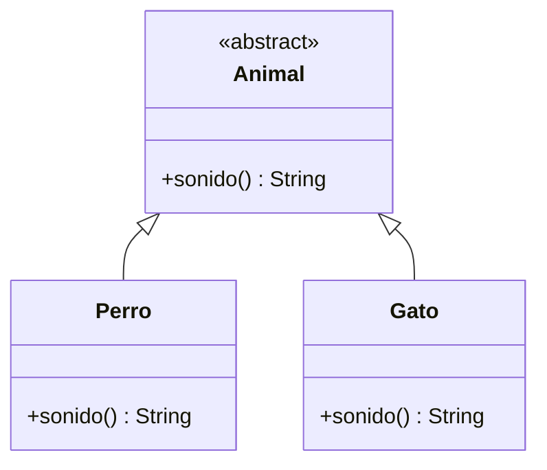

#Python #Poliformism 

Es un principio de la programación orientada a objetos que permite que objetos de diferentes clases sean tratados de la misma manera a través de una interfaz común. Esto significa que un solo método puede funcionar con diferentes tipos de objetos.



El polimorfismo permite que una clase hija o subclase sobrescriba métodos de su clase padre o superclase.

```python
class Empleado:
	def __init__(self, nombre, sueldo):
		self._nombre = nombre
		self._sueldo = sueldo
		
	def __str__(self):
		return f'Empleado: {self._nombre}, {self._sueldo}'
	
	def mostrarDetalles(self):
		return self.__str__()

class Gerente(Empleado):
	def __init__(self, nombre, sueldo, departamento):
		super().__init__(nombre, sueldo)
		self._departamento = departamento
		
	def __str__(self):
		return f'Gerente: {self._departamento}, {super().__str__()}'
		

empleado = Empleado('Juan', 22000)
print(empleado.mostrarDetalles())

gerente = Gerente('Karla', 24000, 'Sistemas')
print(gerente.mostrarDetalles())
```

En el código anterior, estamos reutilizando el método `mostrarDetalles()` de la clase padre Empleado, como el código dicta que el parámetro de la función es `self`, significa que es un método de instancia, este metodo apunta a llamar a `__str__`, el cual es diferente en la hija y la padre, entonces mostrar mostrar detalles funciona tanto en la clase hija como la clase padre, haciendo dos cosas difrentes. Este es el concepto de polimorfismo.

## Función `isinstance()`

Este método nos devuelve `True` o `False` si el objeto que le otorgamos es instancia de una clase especifica. La sintaxis es la siguiente:

```python
if isinstance(gerente, Gerente):
	print(gerente._departamento)   # Esto no es una buena practica (_var)
else:
	print('Tu variable gerente no pertenece a la clase Gerente')
```

Esto se usa para poder reutilizar mas las funciones en las clases. Aunque no es recomendable que los métodos hagan muchas validaciones de los tipos, solo en cuestiones muy especificas.

