#Python #SQL #PostgreSQL

El ejercicio dicta el siguiete diagrama UML:

```mermaid
classDiagram
    class Conexion {
        +String DATABASE
        +String USERNAME
        +String PASSWORD
        +String DB_PORT
        +String HOST
        +Connection conexion
        +Cursor cursor

        +Connection __obtenerConexion__()
        +Cursor __obtenerCursor__()
        +__cerrar__()
        Responsabilidades:
        Administrar la conexión a la base de datos
    }

    class Persona {
        +int id_persona
        +String nombre
        +String apellido
        +String email

        +String __str__()
        +Get/Set de cada atributo
        Responsabilidades:
        Crear objetos de entidad Persona
    }

    class PersonaDao {
        +String __SELECCIONAR__
        +String __INSERTAR__
        +String __ACTUALIZAR__
        +String __ELIMINAR__

        +__seleccionar__()
        +__insertar__(Persona persona)
        +__actualizar__(Persona persona)
        +__eliminar__(Persona persona)
        Responsabilidades:
        Realizar las operaciones sobre la base de datos de entidad Persona
    }

    Conexion <|-- PersonaDao : Usa
    PersonaDao *-- Persona : Gestiona

```



>Cuando una clase genera registros para una base de datos, a esos objetos que serán registros se les conoce como `entidad`. ^entidad


> [!summary] DAO
> **`DATA ACCES OBJECT`** - Patron de diseño para comunicarse con una base de datos. Consiste en volver objetos los registros y registros los objetos. 
> 
>**DAO** Tiene las operaciones **CRUD**: (*Create, Read, Update y Delete*) de una Entidad (persona, en este caso).
>
==**Entidad:** Es un objeto con atributos que iran en una base de datos==.

El codigo final es el siguiente: 

>**ABRIR EN VSCODE**

```python
from Conexion import Conexion as cn
from logger_base import log
from Persona import Persona

# DAO: DATA ACCES MEMORY - Patron de diseño para comunicarse con una base de datos
# DAO Tiene las operaciones CRUD: (Create, Read, Update y Delete) de una Entidad (persona, en este caso)
# Recordar que Entidad es un objeto con atributos que iran en una base de datos

class PersonaDao:
    __SELECCIONAR = 'SELECT * FROM persona ORDER BY id_persona'
    __INSERTAR = 'INSERT INTO persona(nombre, apellido, email) VALUES (%s, %s, %s)'
    __ACTUALIZAR = 'UPDATE persona SET nombre = %s, apellido = %s, email = %s WHERE id_persona = %s'
    __ELIMINAR = 'DELETE FROM persona WHERE id_persona = %s'
    
    @classmethod
    def seleccionar(cls):
        with cn.obternerConexion():
            with cn.obtenerCursor() as cursor:
                cursor.execute(cls.__SELECCIONAR)
                registros = cursor.fetchall()
                personas = []
                # Para hacerlo DAO debemos meter los resultados de las consultas en objetos de tipo persona
                # Metemos los objetos de tipo persona en una lista de objetos
                for registro in registros:
                    persona = Persona(registro[0], registro[1], registro[2], registro[3])
                    personas.append(persona)
                return personas

    @classmethod
    def insertar(cls, persona):
        with cn.obternerConexion():
            with cn.obtenerCursor() as cursor:
                valores = (persona.nombre, persona.apellido, persona.email)
                cursor.execute(cls.__INSERTAR, valores)
                log.debug(f'Datos insertados: {persona}')
                return cursor.rowcount

    @classmethod
    def actualizar(cls, persona):
        with cn.obternerConexion():
            with cn.obtenerCursor() as cursor:
                valores = (persona.nombre, persona.apellido, persona.email, persona.id_persona)
                cursor.execute(cls.__ACTUALIZAR, valores)
                log.debug(f'{persona} con id = {persona.id_persona} filas modificadas.')
                return cursor.rowcount

    @classmethod
    def eliminar(cls, persona):
        with cn.obternerConexion():
            with cn.obtenerCursor() as cursor:
                valores = (persona.id_persona,)
                cursor.execute(cls.__ELIMINAR, valores)
                log.debug(f'{persona} eliminado en la DB.')
                return cursor.rowcount

if __name__ == '__main__':
    # Insertar una persona a la base de datos
    persona1 = Persona(nombre='Pedro', apellido='Najera', email='pnajera@mail.com')
    personas_insertadas = PersonaDao.insertar(persona1)
    log.debug(f'Filas insertadas: {personas_insertadas}')


    # # Seleccionar o mandar a llamar a los registros:
    personas = PersonaDao.seleccionar()
    # Manda a llamar el metodo __str__ de cada objeto en la lista
    for persona in personas:
        log.debug(persona)

    # Actualizar un registro:
    persona2 = Persona('Juan', 'Carraso', 'jcarraso@mail.com', 5)
    datos = PersonaDao.actualizar(persona2)

    # Eliminar un registro
    persona3 = Persona(id_persona=5)
    personas_eliminadas = PersonaDao.eliminar(persona3)
    print(personas_eliminadas)
```