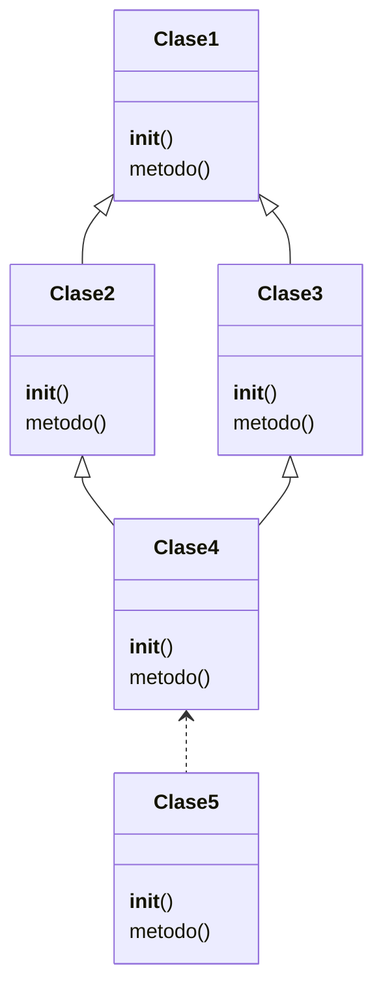

#Python #MRO #Herencia 

El proposito es entender correctamente como funciona el `mro`, el diagrama uml es el siguiente:



```python
class Clase1:
    def __init__(self):
        print('Metodo Init Clase1')
            
    def metodo(self):
        print('Metodo Clase1')

class Clase2(Clase1):
    def __init__(self):
        print('Metodo Init Clase2')

    def metodo(self):
        print('Metodo Clase2')
        super().metodo()

class Clase3(Clase1):
    def __init__(self):
        print('Metodo Init Clase2')
        super().metodo()

    def metodo(self):
        print('Metodo Clase3')
        super().metodo()
        
        
class Clase4(Clase2, Clase3):
    def metodo(self):
        print('Metodo Clase4')
        super().metodo()
        
        
if __name__ == '__main__':
    objeto1 = Clase4()
    # Saber cuales son las clases padres
    print(Clase4.__bases__)
    print(Clase4.__mro__)
    objeto1.metodo()
```

Por ende, se puede entender que el orden de clases mro es el que define la prioridad/orden de clase conforme se mandaron a sobrescribir y __no es en arbol__, para modificar eso basta con cambiar el orden en el que se eligen las clases de las que hereda nuestra clase hija. De igual manera, cuando hagamos uso de `super()` se hara en el orden del `mro`, por lo que hay que considerarlo por si se sobrescriben los metodos de clases hijas.

Para evitar todo esto tambien podemos evitar hacer uso de `super()`, puede ahorrarnos tiempo de depuración, a menos que se maneje muy bien este concepto, sin embargo dificulta la lectura del código.

## `isinstance()`:

Podemos hacer uso de 