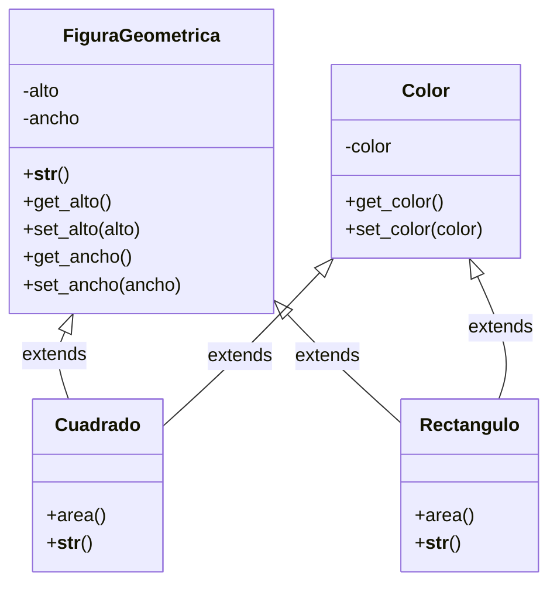

#Python #Ejercicio 


> [!example] Diseñar un codigo en python multiclase con las siguientes caractersiticas:



```python
class FiguraGeometrica:
	def __init__(self, alto, ancho):
	# Agregamos condiciones de inicializacion:
		if self._validarInfo(alto):
			self._alto = alto
			if self._validarInfo(ancho):
				self._ancho = ancho
		else:
			self._ancho = 0
			self._alto = 0
		
	def __str__(self):
		return f'La figura geometrica tiene un alto de {self._alto} y un ancho de {self._ancho}'

	def _validarInfo(self, dato):
		if type(dato) == int:
			return True
		else:
			print('Error: Dato no valido')
			return False
	# def _validarInfo(self, dato):
	# return True if type(dato) == int else False
		
	@property
	def alto(self):
		return self._alto
	@alto.setter
	def alto(self, alto):
		if self._validarInfo(alto):
			self._alto = alto
		else:
			self._alto = 0
	@property
	def ancho(self):
		return self._ancho
	@ancho.setter
	def ancho(self, ancho):
		if self._validarInfo(ancho):
			self._ancho = ancho
		else:
			self._ancho = 0

class Color:
	def __init__(self, color):
		self._color = color

	@property
	def color(self):
		return self._color
	@color.setter
	def color(self, color):
		self.color = color

class Cuadrado(FiguraGeometrica, Color):
	def __init__(self, alto, color):
	# Mapeo de variables al inicializar
		FiguraGeometrica.__init__(self, alto, alto)
		Color.__init__(self, color)
		
	def area(self):
		return self._alto * self._ancho
		
	def __str__(self):
		return f'{FiguraGeometrica.__str__(self)}, es un Cuadrado {self._color} y su area es de {Cuadrado.area(self)}' 

class Rectangulo(FiguraGeometrica, Color):
	def __init__(self, alto, ancho, color):
		FiguraGeometrica.__init__(self, alto, ancho)
		Color.__init__(self, color)

	def area(self):
		return self._alto * self._ancho

	def __str__(self):
		return f'{FiguraGeometrica.__str__(self)}, es un Rectangulo {self._color} y su area es de {Rectangulo.area(self)}'

square1 = Cuadrado(color = 'Rojo', alto = 10)
# square1.alto = 'a'
print(square1)

rect1 = Rectangulo(alto = 5, ancho = 10, color = 'Verde')
print(rect1)
```


> [!info] Notas:
>-  Cuando llamamos al metodo `__str__` se escribe self en los parentesis para indicar que estamos trabajando con esa clase del objeto, por lo tanto la clase padre
>- Si especificamos la variable en la clase al crear el objeto, no es necesasrio respetar el orden de este. También es una buena forma de documentar para que en un futuro sea mas facil de interpretar el codigo.
>- Cuando una función empieza con guion bajo o doble guion bajo, significa que no se debe de usar fuera de la clase misma.
