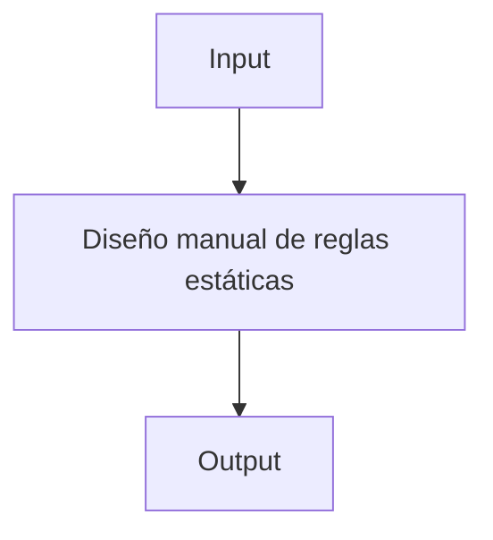
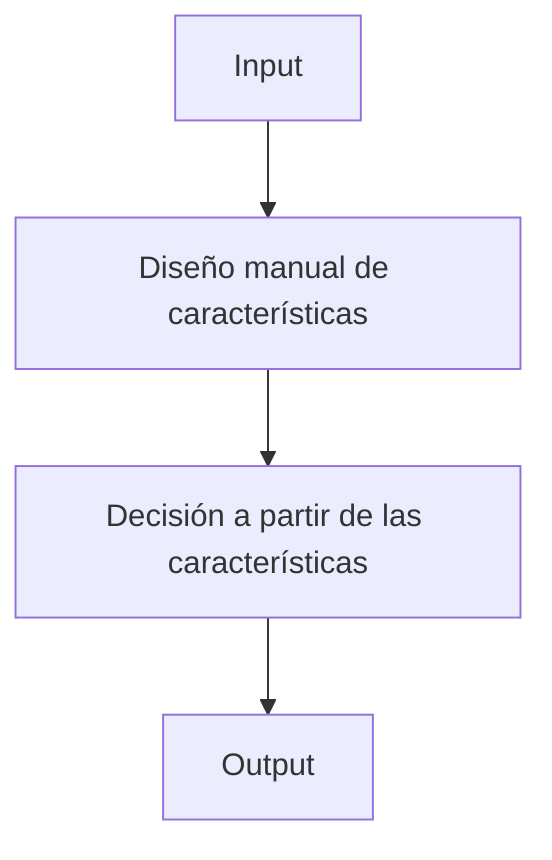
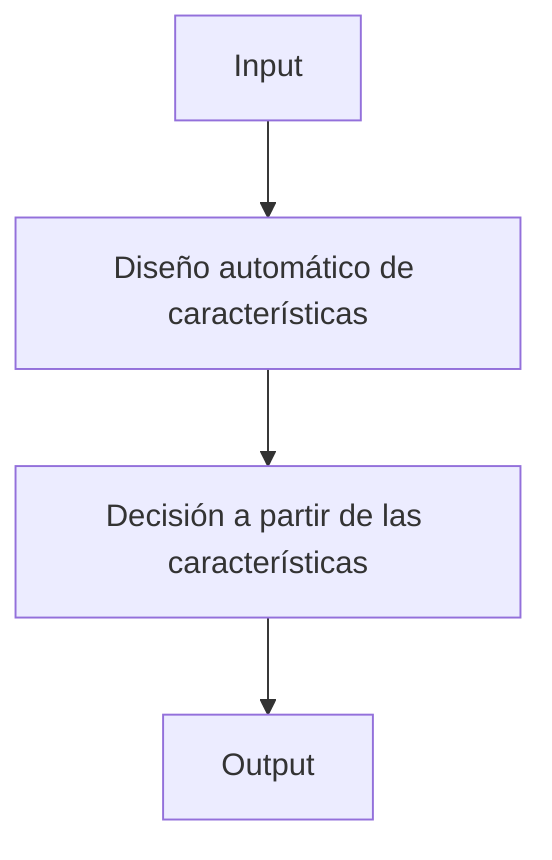
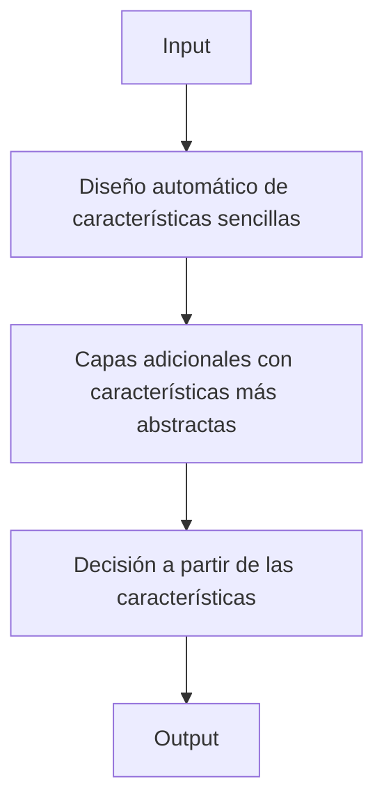
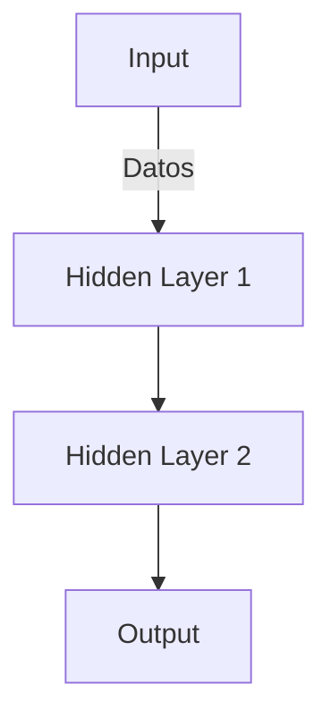
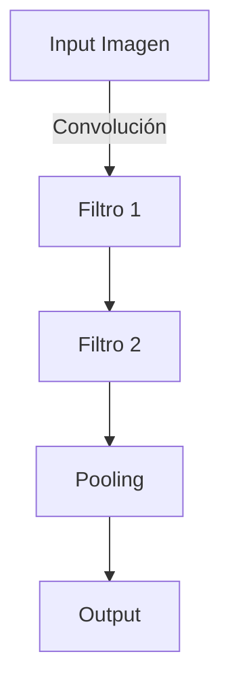
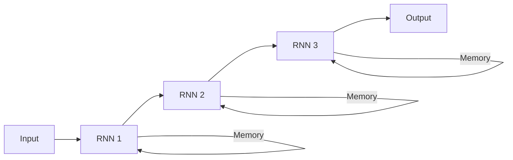

## ¿Qué es el Deep Learning?
Deep Learning es un subcampo del **Machine Learning** que utiliza **redes neuronales artificiales (ANNs)** para modelar patrones complejos en datos. A diferencia de las técnicas tradicionales de Machine Learning, donde se requiere el diseño manual de características, el Deep Learning automatiza esta tarea mediante múltiples capas de neuronas que extraen representaciones jerárquicas de la información.

>[!info]
El **Deep Learning** se destaca en problemas donde los datos no tienen estructuras claras o son de alta dimensionalidad, como en imágenes, audio y texto.


![[dataVSperformance.png]]

## Diferencias clave entre ML tradicional y DL
| Machine Learning Tradicional  | Deep Learning  |
|-------------------------------|----------------|
| Diseño manual de características | Aprendizaje automático de características |
| Requiere feature engineering   | Feature engineering automatizado |
| Modelos simples (SVM, Decision Trees) | Modelos complejos (Redes Neuronales Profundas) |
| Se adapta a problemas simples  | Se adapta a datos complejos y no estructurados |
A continuacion, unos diagramas que explican esta tabla:

> Sistemas basados en reglas y heurísticas


> Técnicas clásicas de Machine Learning


> Técnicas básicas de Representation Learning


> Técnicas de Deep Learning


### ## Redes Neuronales Artificiales (ANN)
Una ANN está compuesta por **capas de neuronas** conectadas entre sí. Las más comunes son:

1. **Capa de entrada:** recibe los datos de entrada.
2. **Capas ocultas:** procesan la información. Cada capa aprende diferentes niveles de abstracción.
3. **Capa de salida:** genera la predicción final.

En una **red neuronal profunda**, hay múltiples capas ocultas que permiten extraer patrones complejos.



## Forward Propagation y Backpropagation
El entrenamiento de una red neuronal involucra dos fases principales:

1. **Forward Propagation:** El flujo de los datos desde la capa de entrada hasta la capa de salida.
2. **Backpropagation:** Proceso en el cual el error de la salida se propaga hacia atrás para ajustar los pesos de las conexiones en la red.

#### Forward Propagation
- En cada capa, los datos de entrada se multiplican por un conjunto de **pesos** y se suman a un **sesgo** (bias).
- Luego, se aplica una **función de activación** (como ReLU o Sigmoid) para introducir no linealidades en el modelo.

#### Backpropagation
- Se utiliza la **derivada parcial** del error con respecto a los pesos, ajustando los pesos mediante el algoritmo de optimización (como **SGD** o **Adam**).

## Arquitecturas Comunes de Deep Learning

## Redes Neuronales Convolucionales (CNN)
- **Usadas principalmente en visión por computadora.**
- Aplican **filtros convolucionales** que detectan características locales (bordes, texturas).
- **Pooling layers** reducen la dimensionalidad de las características aprendidas.



## Redes Neuronales Recurrentes (RNN)
- **Usadas en datos secuenciales**, como procesamiento de lenguaje natural y series temporales.
- Mantienen una **memoria temporal** para capturar la dependencia entre los pasos previos y actuales.



## Funciones de Activación
Las funciones de activación transforman los datos a través de las capas:

- **ReLU (Rectified Linear Unit):** \[f(x) = max(0, x)\]
    - Ventaja: Introduce no linealidad y es eficiente computacionalmente.
    - Uso: Es la más común en redes profundas.
    
- **Sigmoid:** \[f(x) = \frac{1}{1 + e^{-x}}\]
    - Ventaja: Proporciona valores en el rango [0, 1], útil para salidas binarias.
    
- **Tanh:** \[f(x) = \frac{2}{1 + e^{-2x}} - 1\]
    - Ventaja: Suprime valores extremos, útil para señales de entrada normalizadas.

## Ejemplo práctico: Clasificación de imágenes con CNN
Vamos a entrenar una CNN usando **Keras** y el dataset **MNIST**, que contiene imágenes de dígitos escritos a mano.

```bash
# Instalamos las dependencias necesarias
pip install tensorflow keras
```

```python
import tensorflow as tf
from tensorflow.keras import layers, models
from tensorflow.keras.datasets import mnist

# Cargamos el dataset MNIST
(x_train, y_train), (x_test, y_test) = mnist.load_data()

# Normalizamos las imágenes
x_train, x_test = x_train / 255.0, x_test / 255.0

# Construimos la CNN
model = models.Sequential([
    layers.Conv2D(32, (3, 3), activation='relu', input_shape=(28, 28, 1)),
    layers.MaxPooling2D((2, 2)),
    layers.Conv2D(64, (3, 3), activation='relu'),
    layers.MaxPooling2D((2, 2)),
    layers.Conv2D(64, (3, 3), activation='relu'),
    layers.Flatten(),
    layers.Dense(64, activation='relu'),
    layers.Dense(10, activation='softmax')
])

# Compilamos el modelo
model.compile(optimizer='adam',
              loss='sparse_categorical_crossentropy',
              metrics=['accuracy'])

# Entrenamos el modelo
model.fit(x_train, y_train, epochs=5, validation_data=(x_test, y_test))
```

## Regularización y sobreajuste
El Deep Learning tiene una tendencia al **sobreajuste** (overfitting), debido a su alta capacidad de modelado. Para mitigar esto:

1. **Dropout:** Desactiva aleatoriamente neuronas durante el entrenamiento.
2. **Batch Normalization:** Normaliza las activaciones dentro de cada capa.
3. **Early Stopping:** Detiene el entrenamiento cuando la precisión en el set de validación deja de mejorar.

```bash
# Ejemplo de modelo con Dropout en Keras
model = models.Sequential([
    layers.Conv2D(32, (3, 3), activation='relu', input_shape=(28, 28, 1)),
    layers.MaxPooling2D((2, 2)),
    layers.Dropout(0.25),  # Dropout
    layers.Conv2D(64, (3, 3), activation='relu'),
    layers.MaxPooling2D((2, 2)),
    layers.Flatten(),
    layers.Dense(64, activation='relu'),
    layers.Dropout(0.5),  # Dropout
    layers.Dense(10, activation='softmax')
])
```

## Conclusiones
El **Deep Learning** ha revolucionado áreas como la visión por computadora, el procesamiento del lenguaje natural y el análisis de datos complejos. Con la disponibilidad de datos y la mejora de hardware (GPUs/TPUs), ha alcanzado niveles de precisión que superan los métodos tradicionales.

>[!info]
Al comenzar con Deep Learning, es esencial comprender cómo las **redes profundas** pueden captar características complejas automáticamente, lo que les permite adaptarse a tareas que antes eran muy difíciles de resolver.
