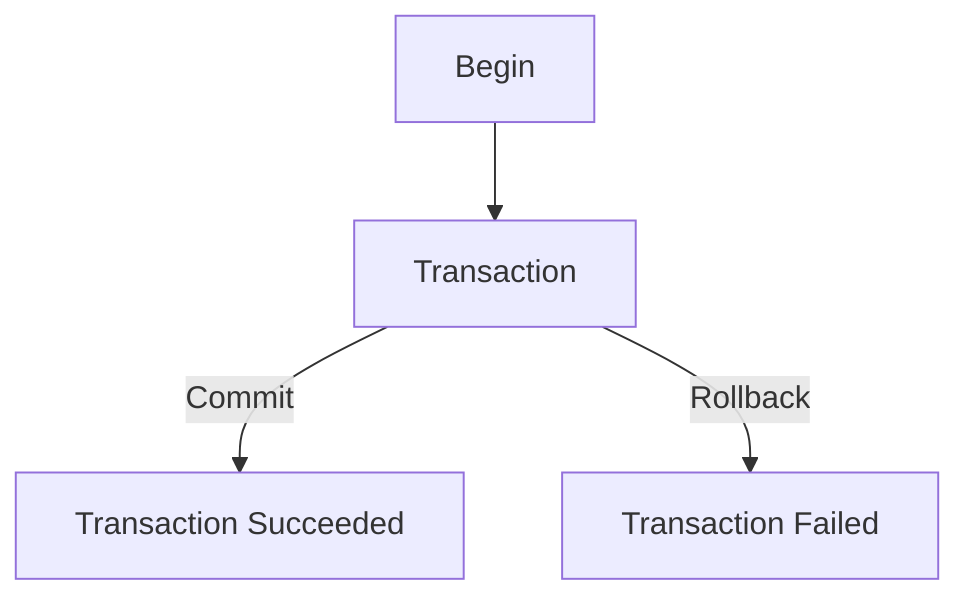

#Python #SQL 

Previamente haber instalado el conector de base de datos:

```powershell
pip install psycopg2 
```

Para conectarnos a nuestra base de datos con python, primero inicializamos la biblioteca:

```python
import psycopg2

conexion = psycopg2.connect(
	user ='postgres',
	password ='admin',
	host = '127.0.0.1',
	port = '5432',
	database = 'test_db'
)
print(conexion)
```

Para crear un cursor (Un cursor es un objeto que nos permitira ejectutar sentencias SQL):

```python
cursor = conexion.cursor()
```

Ahora para ejecutar las sentencias:

```python
sentencia = 'SELECT * FROM persona'
cursor.execute(sentencia)
registros = cursor.fetchall()
print(registros)
```

>Con `cursor.fetchall()` consultamos la respuesta a la sentencia que utilicemos.

Para terminar la sesion:

```python
cursor.close()
conexion.close()
```

## Uso de `with` y Buenas Practicas

Podemos hacer uso de `with` para que se finalice la sesion o el cursor al terminar de procesar las solicitudes.

```python
import psycopg2

conexion = psycopg2.connect(
	user ='postgres',
	password ='admin',
	host = '127.0.0.1',
	port = '5432',
	database = 'test_db'
)

# Encerramos en un try:
try:
	# Aqui no precindimos de as, porque lo declaramos arriba
	with conexion: 
		with conexion.cursor() as cursor:
			cursor.execute('SELECT * FROM persona')
			print(cursor.fetchall())
except Exception as e:
	print(f'Error, excepcion del tipo: {type(e)}')
finally:
	conexion.close()
	print('Conexion finalizada')
```

> [!WARNING] `try y finally`
> Debemos asegurarnos que la conexion a la base de datos sea finalizada al terminar el codigo, por lo que es importante que antes de usar los `with` para acceder a la base de datos hagamos uso de `conexion.close()` en el bloque `finally`.

### `fetchone()`

Esta sentencia solamente recupera una fila especifica y no varias, sirve para obtener información muy puntual.

Cuando ponemos `SELECT *`, seleccionamos todos los elementos de la base de datos, sin embargo tambien podemos hacer uso de `SELECT id_persona, nombre FROM persona` para recuperar esos datos. 

Ahora vamos a modificar el codigo para darle cierto dinamismo:

```python
import psycopg2

conexion = psycopg2.connect(
	user ='postgres',
	password ='admin',
	host = '127.0.0.1',
	port = '5432',
	database = 'test_db'
)

# Encerramos en un try:
try:
	# Aqui no precindimos de as, porque lo declaramos arriba
	with conexion: 
		with conexion.cursor() as cursor:
			sentencia = f'SELECT * FROM persona WHERE id_persona = %s'
			id_persona = str(input('Inserte la llave primaria: '))
			cursor.execute(sentencia, (id_persona,))
			print(cursor.fetchone())
except Exception as e:
	print(f'Error, excepcion del tipo: {type(e)}')
finally:
	conexion.close()
	print('Conexion finalizada')
```


> [!warning] Tupla a la sentencia
> Segun la documentacion de psycopg2, necesitamos asignarle una tupla cuando se usa un parametro posicional. Para asignarlo debe ser en la siguiente sintaxis:
> ```python
> sentencia = 'SELECT * FROM persona WHERE id_persona = %s'
> # En este caso, %s sera interpretado como una variable que se le otorgara a xxxx.execute()
> cursor.execute(sentencia, tupla_con_la_literal)
>```
>Aunque, personalmente recomiendo tratar con `f-strings` la solicitud para evitar complejidad.

- Ahora, el mismo codigo pero para procesar varios registros con la misma sentencia:

```python
import psycopg2

conexion = psycopg2.connect(
	user ='postgres',
	password ='admin',
	host = '127.0.0.1',
	port = '5432',
	database = 'test_db'
)

# Encerramos en un try:
try:
	# Aqui no precindimos de as, porque lo declaramos arriba
	with conexion: 
		with conexion.cursor() as cursor:
			sentencia = f'SELECT * FROM persona WHERE id_persona IN(1,2,3,4,5)'
			cursor.execute(sentencia)
			registros = cursor.fetchall()
			# Ya que es una lista con tuplas
			for reg in registros:
				print(reg)
except Exception as e:
	print(f'Error, excepcion del tipo: {type(e)}')
finally:
	conexion.close()
	print('Conexion finalizada')
```

- Consultar x Datos con una iteracion:

```python
import psycopg2

conexion = psycopg2.connect(
	user ='postgres',
	password ='admin',
	host = '127.0.0.1',
	port = '5432',
	database = 'test_db'
)

# Encerramos en un try:
try:
	# Aqui no precindimos de as, porque lo declaramos arriba
	with conexion: 
		with conexion.cursor() as cursor:
			sentencia = 'SELECT * FROM persona WHERE id_persona IN %s'
			# Como va (1,2,3) es una tupla, pero como hay que asignarle los valores en tuplas, debemos asignarle una tupla con tuplas
			# llaves_primarias = ((1,2,3),)
			entrada = input('Proporciona los id\'s a buscar (separado por comas): ')
			llaves_primarias = (tuple(entrada.split(',')),)
			# Convertimos en una lista la entrada, separando por cada coma, despues la lista la volvemos una tupla y al final la metemos en otra tupla
			cursor.execute(sentencia, llaves_primarias)
			registros = cursor.fetone()
			print(registros)
except Exception as e:
	print(f'Error, excepcion del tipo: {type(e)}')
finally:
	conexion.close()
	print('Conexion finalizada')
```

## Agregar Valores a la Base de Datos

```python
import psycopg2

conn = psycopg2.connect(
	user ='postgres',
	password ='admin',
	host = '127.0.0.1',
	port = '5432',
	database = 'test_db'
)

try:
    with conn:
        with conn.cursor() as cursor:
            sentencia = 'INSERT INTO persona(nombre, apellido, email) VALUES (%s, %s, %s)'
            # Convertimos en str la cadena y eliminamos espacios
            scan = str(input('Dame los valores [Nombre, Apellido, Email] separados por coma para agregarlos a la base de datos: ')).replace(' ', '')
            # onvertimos en lista con el caracter "," y la lista la volvemos una tupla 
            values = tuple(scan.split(','))
            cursor.execute(sentencia, values)
            # AL caracter | le juntamos la variable iterada actual de la tupla convertida en texto 
            print(f'Casillas Agregadas: {cursor.rowcount}: {' | '.join(str(val) for val in values)}')
except Exception as e:
    print(f'Error del tipo: {type(e)}, {e}')
finally:
    conn.close()
    print('Conexion finalizada')
```


> [!question] `cursor.commit()`
> Teóricamente, despues de mandar a hacer un dato, debemos dar esa orden, sin embargo no lo hacemos ya que en su clase con el [[Manejo de Contexto `with`|Context Manager]] esta agregado que se hara automaticamente el commit.


- Insertar varios registros a la vez usando `executemany()`:

```python
import psycopg2

conn = psycopg2.connect(
	user = 'postgres',
	password = 'admin',
	host = '127.0.0.1',
	port = '5432',
	database = 'test_db'
	)

try:
	with conn:
		with conn.cursor() as cursor:
			sentence = 'INSERT INTO persona(nombre, apellido, email) VALUES(%s, %s, %s)'
			values = (
			('Damian', 'Gonazlez', 'dgonzales@mail.com'),
			('Jorge', 'Rosas', 'jrosas@mail.com'),
			('Jessica', 'Fernandez', 'jfernandez@mail.com')
			)
			cursor.executemany(sentence, values)
			print(f'Registros agregados: {cursor.rowcount}')
except Exception as e:
	print(f'Error, excepcion del tipo {type(e)}: {e}')
finally:
	conn.close()
	print('Conexion finalizada')
```

## Actualizar Varios Registros con Input

```python
import psycopg2

cnn = psycopg2.connect(
    user = 'postgres',
    password = 'admin',
    host = '127.0.0.1',
    port = '5432',
    database = 'test_db'
)

try:
    with cnn:
        with cnn.cursor() as cursor:
            sentence = 'UPDATE persona SET nombre = %s, apellido = %s, email = %s WHERE id_persona = %s'
            scan = input('Dame los n valores en orden [Nombre, Apellido, Email, ID]: ').replace(' ', '')
            # Hacemos una lista del str que tenemos de (',') y lo volvemos una tupla
            subtuple = tuple(scan.split(','))
            # Hacemos que la lista tenga un rango de for brincado en cuatro, sumado en el tamaño de lista deseada, empieza en 0, termina en el ancho de la lista, avanza de 4 en cuatro y todo se convierte en una tupla
            subtuples = tuple([subtuple[i:i + 4] for i in range(0, len(subtuple), 4)])
            cursor.executemany(sentence, subtuples)
            print(f'{cursor.rowcount} registros actualizados.')
except Exception as e:
    print(f'Error del tipo: {type(e)}: {e}')
finally:
    cnn.close()
    print('Conexion ended')
```

## Eliminar un Registro

```python
import psycopg2

conn = psycopg2.connect(
    user = 'postgres',
    password = 'admin',
    host = '127.0.0.1',
    port = '5432',
    database = 'test_db'
)

try:
    with conn:
        with conn.cursor() as cursor:
            sentence = 'DELETE FROM persona WHERE id_persona = %s'
            id_persona = (input('Dame el valor ID de la fila que deseas borrar: '),)
            cursor.execute(sentence, id_persona)
            print(f'{cursor.rowcount} registros borrados.')
except Exception as e:
    print(f'Error de tipo {type(e)}: {e}.')
finally:
    conn.close()
    print('Conexion ended.')
```

## Eliminar Varios Registros

```python
from typing import final
import psycopg2

conn = psycopg2.connect(
    user = 'postgres',
    password = 'admin',
    host = '127.0.0.1',
    port = '5432',
    database = 'test_db'
)

try:
    with conn:
        with conn.cursor() as cursor:
            sentence = 'DELETE FROM persona WHERE id_persona = %s'
            scan = input('Dame el valor de los id\'s para eliminar las filas (separados por coma ","): ').replace(' ', '')
            ids_persona = tuple(scan.split(','))
            cursor.executemany(sentence, ids_persona)
            print(f'{cursor.rowcount} registros eliminados.')
except Exception as e:
    print(f'Error del tipo {type(e)}: {e}')
finally:
    conn.close()
    print('Conexion ended.')
```

## Corregir Error: No Informacion Mostrada en Python

Cuando usamos `psycopg2`, este no tiene programado el tipo de error en español, por lo que puede ser complicado saber si por ejemplo, se introdujo mal el usuario. Para ello debemos localizarnos en la siguiente carpeta y editar el archivo `postgresql.conf`:

```dirtree
- \Ruta_instalacion_postgresql
- \Otros_directorios
- Archivos
	- \16
		- \Data
		- \Otros_directorios
		- OtrosArchivos
			- postgresql.conf
```

Debemos agregar las siguientes líneas para indicar que ahora usaremos el lenguaje `ingles`:

```
lc_messages = 'en-US'
lc_monetary = 'en-US'
lc_numeric = 'en-US'
lc_time = 'en-US'
```

## Transacciones con PosgreSQL

Las transacciones consisten en hacer querys a la base de datos y si todos estos se ejecutan de manera exitosa, hacemos el `commit` o guardamos los datos, en caso contrario hacemos un `rollback`, ósea revertimos los cambios.



Esto es básicamente lo que hacemos con `with`, sin embargo, para hacerlo manual y poder visualizarlo de manera correcta, tenemos el siguiente codigo: ^withPostgreSQL

```python
import psycopg2 as db

conn = db.connect(
    user = 'postgres',
    password = 'admin',
    host = '127.0.0.1',
    port = '5432',
    database = 'test_db'
)

try:
    # ELegimos si se guardan los cambios automaticamente
    conn.autocommit = False
    cursor = conn.cursor()
    sentence = 'INSERT INTO persona(nombre, apellido, email) VALUES(%s, %s, %s)'
    values = ('Maria', 'Esparza', 'mesparaza@mail.com')
    cursor.execute(sentence, values)
    print('Termina la transaccion')
    # Para guardar los cambios:
    conn.commit()
except Exception as e:
    # Si hay alguna excepcion, hacemos rollback:
    conn.rollback()
    print(f'Errro del tipo: {type(e)}: {e}')
    print('Se hizo rollback debido al error.')
finally:
    conn.close()
    print('Conexion ended.')
```


> [!summary] `Commit`
> Si dejamos el `cnn.autocommit = True` (por defecto esta en `False`), no será necesario hacer el `cnn.commit()`. Esto no es una buena practica, lo recomendable es que si no se usa el Context Manager, debemos hacer los commit mannualmente.
> 
> Recordar que cuando hacemos `with cnn:` es lo que se esta haciendo por defecto dentro de nuestro bloque.

- Para varias sentencias en nuestra transaccion:
```python
import psycopg2 as db

conn = db.connect(
    user = 'postgres',
    password = 'admin',
    host = '127.0.0.1',
    port = '5432',
    database = 'test_db'
)

# Definimos nuestra transaccion con un bloque try:
try:
    # ELegimos si se guardan los cambios automaticamente
    conn.autocommit = False
    
    cursor = conn.cursor()
    sentence = 'INSERT INTO persona(nombre, apellido, email) VALUES(%s, %s, %s)'
    values = ('Carlos', 'Lara', 'clara@mail.com')
    cursor.execute(sentence, values)
    
    sentence = 'UPDATE persona SET nombre = %s, apellido = %s, email = %s WHERE id_persona = %s'
    values = ('Juan Carlos', 'Juarez', 'jcjuarez@mail.com', 1)
    cursor.execute(sentence, values)
    
    # Para guardar los cambios:
    conn.commit()
    print('Termina la transaccion, se hizo commit')
except Exception as e:
    # Si hay alguna excepcion, hacemos rollback:
    conn.rollback()
    print(f'Errro del tipo: {type(e)}: {e}')
    print('Se hizo rollback debido al error.')
finally:
    conn.close()
    print('Conexion ended.')
```


> [!info] No es necesario que la sentencia `SELECT` este dentro del commit, ya que solo es una consulta.

